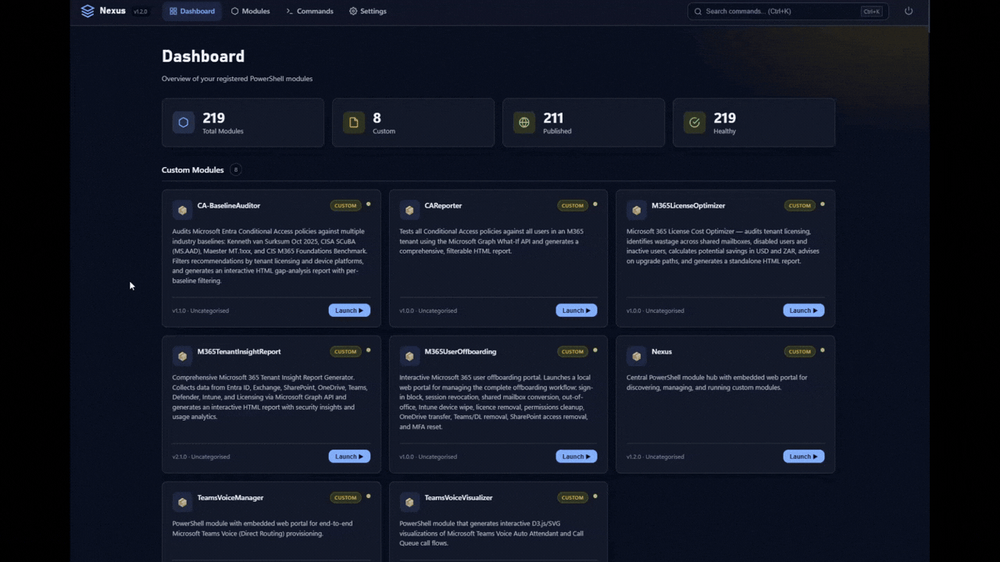

<p align="center">
	
</p>

# Nexus

Central PowerShell module hub with a local web portal for discovering, importing, and invoking commands across your private modules.

## Demo

<p align="center">
	
</p>

## Why Nexus

- One place to register and manage internal PowerShell modules
- Local browser portal for command discovery and execution
- CLI-first workflow with exported functions and a short alias
- JSON-based settings and module registry with local override support

## Requirements

- PowerShell 7.2 or newer
- Windows

> [!NOTE]
> Nexus is Windows-only today: module discovery uses Windows path separators, process
> isolation launches workers with `-WindowStyle`, and `Enable-NexusAutoStart` writes a
> Windows-shaped profile block.

## Quick Start

```powershell
# From the repository root
Import-Module .\Nexus.psd1 -Force

# Start the portal (browser opens by default)
Start-Nexus

# Alias for Start-Nexus
ops
```

>[!TIP]
> Use `Start-Nexus -Scan` to discover modules from configured scan roots during startup.

## Auto-Run On PowerShell Launch

If you want Nexus to start automatically whenever you open PowerShell, use the built-in helper command:

```powershell
# From the repository root
Import-Module .\Nexus.psd1 -Force

# All hosts (Windows Terminal, VS Code terminal, etc.)
Enable-NexusAutoStart

# Or VS Code terminal only
Enable-NexusAutoStart -Scope CurrentHost
```

This writes an idempotent profile block that starts Nexus in a background PowerShell process only when Nexus is not already running.

### Option A: All PowerShell Hosts (Recommended)

Use `CurrentUserAllHosts` so it runs in Windows Terminal, VS Code terminal, and other hosts.

```powershell
if (!(Test-Path $PROFILE.CurrentUserAllHosts)) {
	New-Item -ItemType File -Path $PROFILE.CurrentUserAllHosts -Force | Out-Null
}
notepad $PROFILE.CurrentUserAllHosts
```

Add this to the opened profile file:

```powershell
# Auto-start Nexus once if not already running
$nexusRoot = "<path-to-your-nexus-repo>"
$modulePath = Join-Path $nexusRoot "Nexus.psd1"

if (Test-Path $modulePath) {
	$alreadyRunning = $false
	try {
		$null = Invoke-RestMethod -Uri "http://localhost:8090/api/health" -TimeoutSec 1
		$alreadyRunning = $true
	} catch {
		$alreadyRunning = $false
	}

	if (-not $alreadyRunning) {
		$cmd = "Import-Module '$modulePath' -Force; Start-Nexus -NoBrowser"
		Start-Process pwsh -WindowStyle Hidden -ArgumentList "-NoLogo", "-NoProfile", "-Command", $cmd | Out-Null
	}
}
```

### Option B: VS Code Terminal Only

Use `CurrentUserCurrentHost` instead:

```powershell
if (!(Test-Path $PROFILE.CurrentUserCurrentHost)) {
	New-Item -ItemType File -Path $PROFILE.CurrentUserCurrentHost -Force | Out-Null
}
notepad $PROFILE.CurrentUserCurrentHost
```

Paste the same auto-start block into that profile.

### Notes

- `Start-Nexus` is a blocking listener — calling it directly occupies your current terminal until you stop it. The auto-start block above runs it via `Start-Process pwsh -WindowStyle Hidden ...` instead, so it launches in a separate hidden process and your terminal stays usable.
- Remove `-NoBrowser` if you want the portal tab to open automatically on startup, or run `Open-Nexus` when you want the portal.
- If you changed `defaultPort` in settings, update the health URL accordingly.

## Session Token

Every `/api/*` route except `/api/health` requires a per-session token. `Start-Nexus`
generates it, opens the portal with `?token=...`, and the portal swaps it for an
HttpOnly, SameSite=Strict cookie. The token is also written to `session.json` under the
Nexus data root, which `Open-Nexus` reads. Script clients send it as `X-Nexus-Token`:

```powershell
$session = Get-Content "$env:LOCALAPPDATA\Nexus\session.json" | ConvertFrom-Json
Invoke-RestMethod "$($session.url)api/modules" -Headers @{ 'X-Nexus-Token' = $session.token }
```

Unauthenticated `/api/health` returns the summary only, without module names or paths.

## Execution Model

Nexus runs module commands in isolated execution contexts so modules can keep their own authentication state and avoid DLL conflicts.

- Most modules run in a persistent runspace for faster repeated execution.
- Modules that depend on conflicting ecosystems such as Microsoft Graph, Exchange Online, or Teams are automatically moved to process isolation.
- Async commands return immediately with a job id, and the portal polls job status until the result is ready.
- Only one async command can run at a time for a given module runspace to avoid pipeline collisions.
- Every path (session, runspace, process) binds parameters through one function, `ConvertTo-BoundParameter`: `"false"` is false for `[bool]`/`[switch]`, comma-separated text splits for array parameters, and blank fields are skipped.
- Commands that return objects show as a table in the portal, with CSV export. Each output line carries `data`, a flat property map, beside its `message` text.

You can inspect async job progress through the portal API:

```text
GET /api/jobs/{id}
```

## Exported Commands

| Command | Description |
|---|---|
| `Start-Nexus` | Start the local Nexus HTTP listener and portal |
| `Stop-Nexus` | Stop the running Nexus listener |
| `Open-Nexus` | Open the running portal in the browser with a valid session |
| `Enable-NexusAutoStart` | Add/update a profile block to auto-start Nexus when PowerShell launches |
| `Get-OpsModule` | List modules in the registry |
| `Import-OpsModule` | Import a registered module |
| `Get-OpsCommand` | List and search commands across registered modules |
| `Invoke-OpsCommand` | Invoke a registered command with parameters |
| `Register-OpsModule` | Register a module path and metadata |
| `Unregister-OpsModule` | Remove a module from the registry |
| `Update-OpsRegistry` | Scan and synchronize registry entries |

## Configuration

Nexus keeps user state — settings, the module registry, and logs — outside the module
folder, at `%LOCALAPPDATA%\Nexus` by default. This survives `Update-Module` (which
installs each version into its own folder) and works when the module is installed
AllUsers, where the module folder isn't writable. Set `$env:NEXUS_HOME` to point
Nexus somewhere else, e.g. to keep working out of a repo checkout during development.

The first run seeds `%LOCALAPPDATA%\Nexus\Config` from the module's own `Config/`
defaults. From then on the module's `Config/` folder is read-only template data —
Nexus never writes back to it.

- `Config/settings.json` (portal behavior, ports, scan settings)
- `Config/modules.json` (module registry)

Local overrides are supported and take precedence when present:

- `Config/settings.local.json`
- `Config/modules.local.json`

Common defaults include:

- `defaultPort`: `8090`
- `portRange`: `8090-8099`
- `openBrowserOnStart`: `true`
- `scanOnStartup`: `false`

## Build, Test, and Analyze

```powershell
# Run analyzer + tests + build
.\build.ps1 -Task CI

# Individual tasks
.\build.ps1 -Task Analyze
.\build.ps1 -Task Test
.\build.ps1 -Task Build
.\build.ps1 -Task Clean
```

## Project Layout

```text
Public/   Exported user commands
Private/  Internal implementation
Workers/  Standalone script launched as a child process for isolated modules
Assets/   Portal UI (HTML/CSS/JS)
Config/   Settings and module registry
Tests/    Pester test suite
```

## Author

Robin Pieterse (Turrito Networks)
